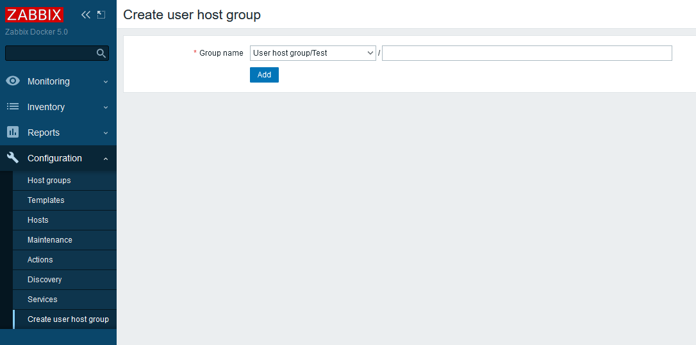

# IntelliTrend Zabbix Admin Hostgroups

This is a Zabbix frontend module that allows Zabbix admins without superadmin permissions to create hostgroups within their write-accessible hostgroups.

## License

This software is licensed under the GNU Lesser General Public License v3.0.

## Download

You can find the latest versions for the respective Zabbix releases on the [Github releases page](https://github.com/intellitrend/zabbix-admin-hostgroups-module/releases).

## Requirements

- Zabbix 6.0, 6.2 or 6.4
- File write access to the Zabbix frontend server

## Installation

For Debian and Ubuntu server, the Zabbix Frontend modules are usually placed in ``/usr/share/zabbix/modules/``.

Copy the folder `modules/admin-hostgroups` to `/usr/share/zabbix/modules/admin-hostgroups` on the Zabbix frontend web server.

Then go to `Administration`, `General`, `Modules`, click `Scan directory` and enable the new module in the list.

## Usage

Once the frontend module is activated, a new menu entry `Create admin host group` should appear for Zabbix admins under `Configuration`.

The host group form is similar to the one for super admins, except it is limited to sub-groups to groups where the admin user has write permissions.
